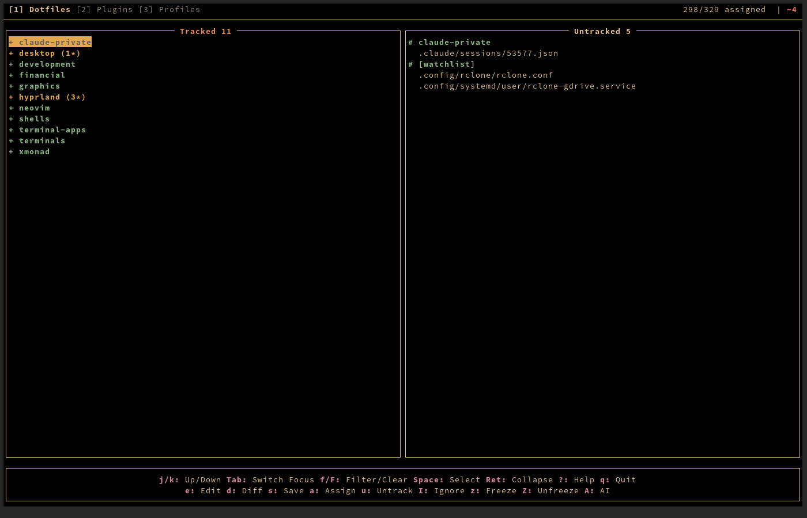
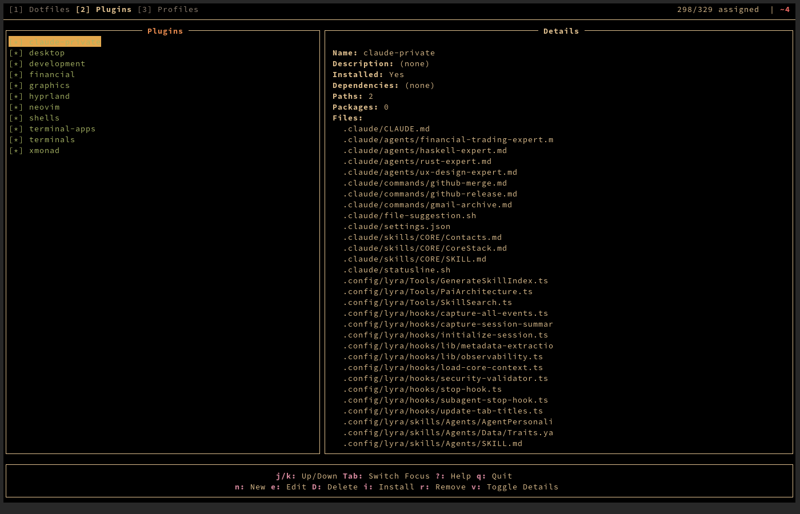
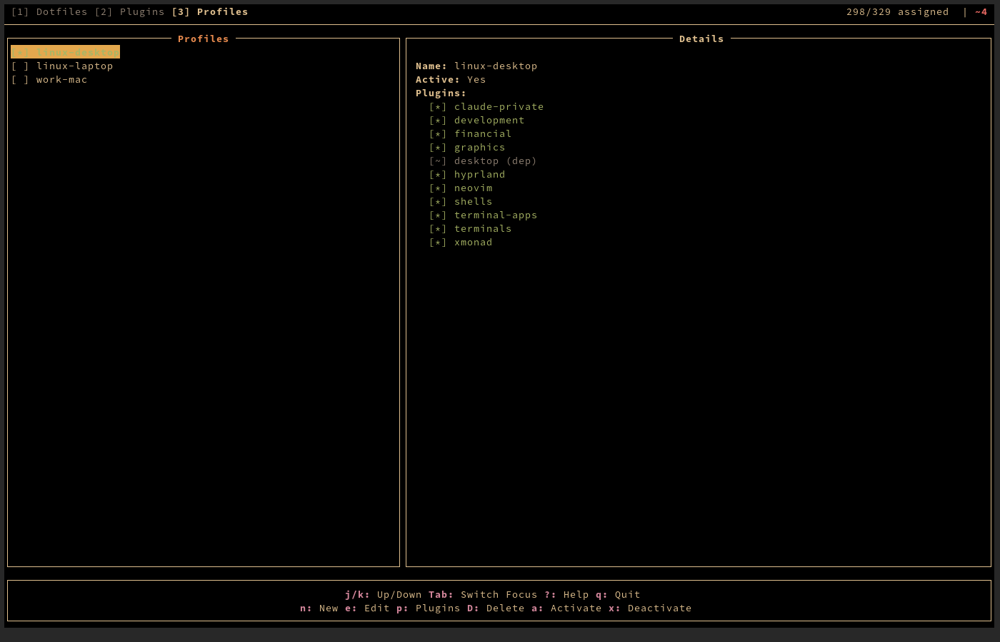

# dotf v3

Modular dotfile manager built on git bare repos with sparse checkout. Organize your config files into **plugins** (logical groups) and **profiles** (machine-specific sets), then manage everything through a Brick TUI or CLI.

Third iteration — rewritten in Haskell from the ground up with a TUI-first design.

## Status


## Screenshots

### Dotfiles Tab
Track, stage, commit, and push dotfiles grouped by plugin. View untracked files from watched paths.



### Plugins Tab
Manage plugins — install with dependency resolution, view paths and OS packages.



### Profiles Tab
Activate machine-specific profiles that control which plugins and files are checked out.



## Features

- **Git bare repo**: Dotfiles tracked in `~/.dotf/` without symlinks
- **Sparse checkout**: Only files from active profile are checked out
- **Plugins**: Group related files with dependencies, OS packages, and post-install hooks
- **Profiles**: Machine-specific plugin sets (e.g., `linux-desktop`, `work-mac`, `server`)
- **Dependency resolution**: Topological sort with cycle detection
- **File freezing**: Skip-worktree bit for files you want tracked but not updated
- **Watchlist**: Monitor paths for new untracked files
- **OS packages**: Auto-install via paru (Arch) or Homebrew (macOS)
- **TUI**: Brick-based terminal UI with vim-style navigation
- **CLI**: Full command set for scripting and automation
- **Concurrent loading**: Parallel config parsing and git queries

## Installation

### Prerequisites

- GHC 9.x + Stack
- Git

### Build from Source

```bash
git clone https://github.com/abjoru/dotf-v3
cd dotf-v3
stack install
```

### Initialize

```bash
# New dotfile repo
dotf init

# Clone existing
dotf new <repo-url>
```

## Core Concepts

### Plugins

A plugin groups related dotfiles with optional dependencies and OS packages:

```yaml
# ~/.config/dotf/plugins.yaml
neovim:
  description: Editor configuration
  paths:
    - .config/nvim
  depends:
    - shells
  arch:
    - neovim
    - python-pynvim
  osx:
    - neovim
```

### Profiles

A profile defines which plugins are active on a machine:

```yaml
# ~/.config/dotf/profiles.yaml
linux-desktop:
  plugins:
    - shells
    - neovim
    - hyprland
    - development

work-mac:
  plugins:
    - shells
    - neovim
    - development
```

Activating a profile installs its plugins (resolving dependencies) and configures sparse checkout to include only the relevant files.

## Usage

### TUI

```bash
dotf                    # Launch TUI (default when no args)
```

**Tabs**: `1` Dotfiles, `2` Plugins, `3` Profiles

**Dotfiles tab**: `s` save (commit+push), `e` edit, `d` diff, `a` assign to plugin, `z`/`Z` freeze/unfreeze, `Space` select, `f` filter

**Plugins tab**: `i` install, `r` remove, `n` new, `e` edit, `v` toggle details

**Profiles tab**: `a` activate, `x` deactivate, `n` new, `p` edit plugins, `D` delete

### CLI

```bash
# Plugins
dotf plugin list
dotf plugin install neovim        # resolves dependencies
dotf plugin remove neovim

# Profiles
dotf profile list
dotf profile activate linux-desktop
dotf profile deactivate

# Tracking
dotf track ~/.config/foo -p myplugin
dotf untrack ~/.config/foo
dotf save "update configs"        # stage + commit + push

# Freezing
dotf freeze ~/.config/secret.conf
dotf unfreeze ~/.config/secret.conf

# Watchlist
dotf watchlist add ~/.config/newapp
dotf watchlist list

# Packages
dotf packages                     # list declared packages
dotf packages --install           # install missing packages

# Git passthrough
dotf git log --oneline -5
dotf status
dotf diff
```

## OS Packages

Plugins can declare OS-specific packages installed automatically on plugin install:

| Field  | Manager           | Platform              |
|--------|-------------------|-----------------------|
| `arch` | paru (AUR/pacman) | Arch Linux / CachyOS  |
| `osx`  | Homebrew formula  | macOS CLI tools       |
| `cask` | Homebrew cask     | macOS GUI apps        |

Third-party Homebrew taps use the full `user/tap/formula` path under `osx`.

## Data Paths

| Purpose  | Path                              | Tracked |
|----------|-----------------------------------|---------|
| Bare repo | `~/.dotf/`                       | —       |
| Plugins  | `~/.config/dotf/plugins.yaml`     | Yes     |
| Profiles | `~/.config/dotf/profiles.yaml`    | Yes     |
| State    | `~/.local/state/dotf/state.yaml`  | No      |

## License

BSD-3-Clause — see [LICENSE](LICENSE) for details.
